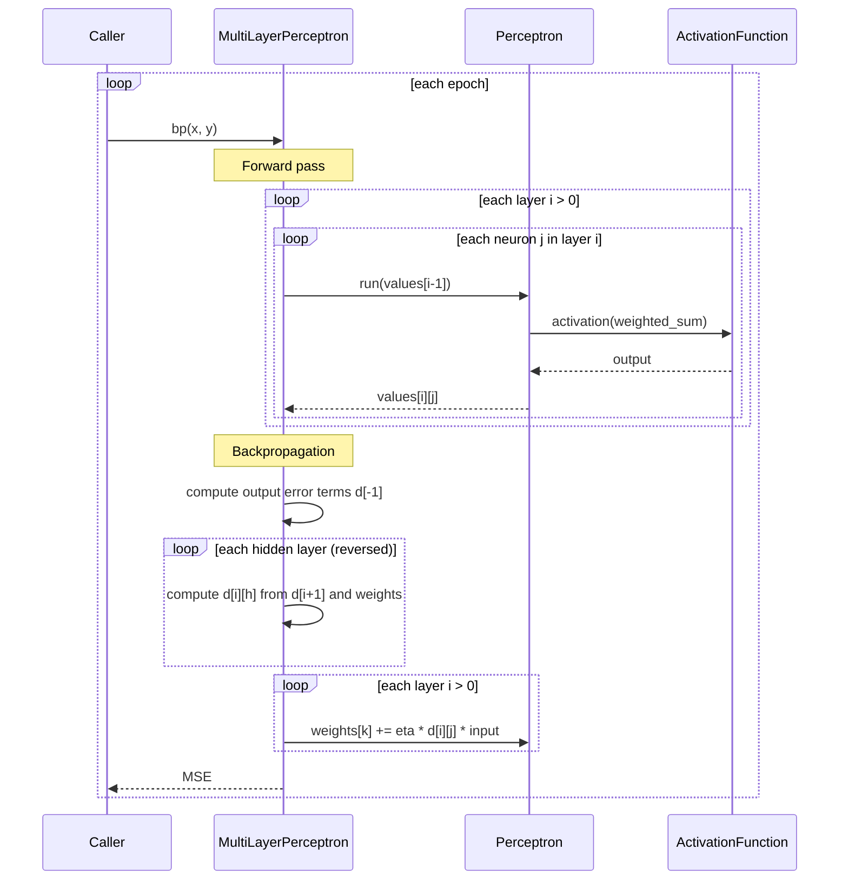

# multilayerperceptron

A from-scratch implementation of a Multilayer Perceptron (MLP) using NumPy, trained with backpropagation.

## Installation

```bash
pip install numpy pytest
```

## Usage

**Run tests**
```bash
pytest tests/
```

**Train and save a model**
```bash
python recognition_cases/digital.py   # → output/digital.npz + output/digital.json
python recognition_cases/mnist.py     # → output/mnist.npz  + output/mnist.json
```

Both scripts train and save automatically in one step. No separate save call needed.

**Load a saved model and run inference**
```python
from src.multilayer_perceptron import MultiLayerPerceptron

mlp = MultiLayerPerceptron.load("output/mnist.npz")
output = mlp.run(image.flatten().tolist())  # → [0.02, 0.01, 0.95, ...]
predicted_digit = output.argmax()
```

**Use the library directly**
```python
mlp = MultiLayerPerceptron(layers=[2, 4, 1], eta=0.5)

for _ in range(5000):
    mlp.bp([0, 0], [0])
    mlp.bp([0, 1], [1])
    mlp.bp([1, 0], [1])
    mlp.bp([1, 1], [0])

print(mlp.run([0, 1]))  # → ~[0.97]
```

## Saved output files

Running either recognition case produces two files in `output/`:

| File | Contents |
|------|----------|
| `*.npz` | Layer shapes + trained weights (needed for inference) |
| `*.json` | Model parameters, MSE per epoch, train/test accuracy |

The `.npz` is the "memory" of what the model learned. The source code in `src/` is the algorithm that uses those weights. You need both to get a prediction — but you only train once, save, then load as many times as needed.

Both file types are excluded from git (see `.gitignore`). Only the empty `output/.gitkeep` is committed.

## Architecture

```
src/
  activations.py             # sigmoid function + ActivationFunction type alias
  perceptron.py              # Single neuron with injectable activation function
  multilayer_perceptron.py   # Fully connected network, backprop, save/load
tests/
  test_perceptron.py
  test_multilayer_perceptron.py
recognition_cases/
  digital.py                 # 7-segment display digits (7 → 7 → 10)
  mnist.py                   # Handwritten digits from 28×28 images (784 → 64 → 10)
output/
  *.npz                      # Saved weights (gitignored)
  *.json                     # Training stats sidecar (gitignored)
```

### Key design decisions

**Injectable activation function** — `Perceptron` accepts any `Callable[[float], float]` as its activation. To use a different activation, pass it at construction:

```python
def relu(x): return max(0.0, x)
p = Perceptron(inputs=3, activation=relu)
```

**No I/O in model classes** — `MultiLayerPerceptron` does not print anything. Logging, weight inspection, and progress reporting are the caller's responsibility.

**Backpropagation** — `bp(x, y)` runs one forward pass and one weight update step, returning the MSE for that sample. Call it in a loop to train.

## Training sequence



## Recognition cases

### 7-segment display (`recognition_cases/digital.py`)

```bash
python recognition_cases/digital.py
```

Each digit (0–9) is encoded as a 7-bit vector representing which segments of a 7-segment display are lit. The network learns to map these patterns to a 10-class one-hot output.

| Digit | Segments (a–g) | Pattern |
|-------|----------------|---------|
| 0 | a b c d e f | `1111110` |
| 1 | b c | `0110000` |
| 2 | a b d e g | `1101101` |
| ... | ... | ... |

**Network:** `7 → 7 → 10` — 3000 epochs, learning rate 0.5.

---

### MNIST handwritten digits (`recognition_cases/mnist.py`)

```bash
pip install scikit-learn
python recognition_cases/mnist.py
```

Each sample is a 28×28 grayscale image stored as a NumPy `ndarray` of shape `(28, 28)`, `dtype=float32`, with pixel values in `[0.0, 1.0]`. It is flattened to 784 inputs before being fed to the network.

```
Shape:  (28, 28)   dtype: float32   range: [0.00, 1.00]

............................
.................##.###.....
...........############.....
........##########..........
Label: 5
```

**Network:** `784 → 64 → 10` — 10 epochs, learning rate 0.1, 1000 training samples.

**Result:** ~84% test accuracy on 200 samples.

MNIST data is downloaded automatically on first run via `scikit-learn` and cached outside the repo at `~\scikit_learn_data\` — not committed to git.

> This implementation uses pure-Python backprop and is not optimised for large datasets. For full MNIST (70k samples) use PyTorch or TensorFlow.
